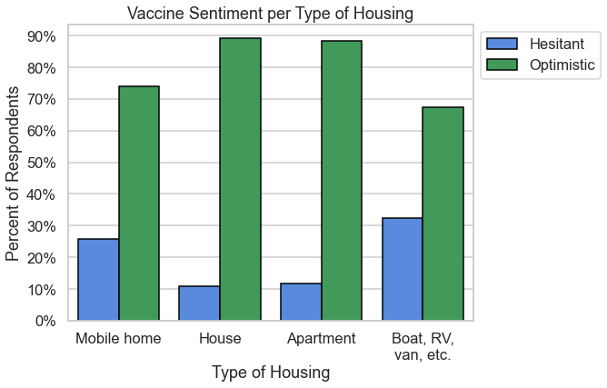

# Encouraging COVID-19 Vaccination in the US
## Understanding hesitancy

**Authors**: Jessica Miles

This repository applies machine learning models to [Household Pulse Survey results published by the Census Bureau](https://www.census.gov/programs-surveys/household-pulse-survey/datasets.html) to determine the primary predictors of vaccine hesitancy and optimism in the US. The purpose is to understand common population characteristics of those who are hesitant, so federal, state, and local governments can develop effective strategies to encourage vaccination.

## The challenge: Declining COVID-19 vaccination rate

- State and local governing bodies around the US are asking: how can we encourage more people to get vaccinated sooner?
- Percentage of vaccinated residents is a key metric used to decide when and how to lift restrictions 
- Vaccines have been proven effective at protecting people from severe illness from COVID-19, which we of course want fewer Americans to experience
- Vaccine doses administered per day initially increased as more people became eligible, but has been declining since mid-April. All adults were eligible in all states as of April 19th, 2021.
- Only 61% of adults have received at least one dose as of May 25, so there are holdouts.
- The percentage of vaccinated people to reach herd immunity varies per disease, and isn't known for COVID-19 yet. For measles it was 95%; for polio it was 80%. Our goal is herd immunity for COVID-19, and 61% is probably not enough yet.


Chart source: [CDC](https://covid.cdc.gov/covid-data-tracker/#vaccination-trends)
### Data:

## Objective of this analysis
To determine whether data-driven insights can reveal strategies to overcome hesitancy and encourage vaccination. Currently, some states are starting to offer perks such as cash or food vouchers, but it's not clear if "bribing" people in this way will be the best approach.

In this analysis, I answer the questions:
- What, if any, are common characteristics among the vaccine hesitant?
- Do hesitant people with different characteristics give different reasons for their hesitancy?

## Methods
- Trained logistic regression and random models to predict vaccine hesitancy or optimism
- Analyzed top predictors of hesitancy to understand their significance, and what insights they could provide into potential new approaches to encourage vaccination

## Sample Data Summary

- US Census Bureau's Household Pulse Survey
  - Random statistical samples from all 50 states and top 15 metro areas
  - Adults 18 years or older
  - Used data from survey conducted March 3 to March 15, 2021
  - Public microdata sample of ~78,000 responses
- Survey questions included:
  - How life had changed for the household during the pandemic
  - Vaccine doses received, intent to be vaccinated, and reasons why if did not definitely intend to be vaccinated
  - Information such as family size, housing situation, state or metro area, employment status, income, age, race and ethnicity

  See data dictionary and survey technical information in the [data](./data) folder.

### Breakdown of vaccine sentiment in survey sample


### Hesitancy reasons (multi-choice)


## Results

### Top Predictors of Hesitancy

Top predictors of hesitancy with odds over 1.5:

| Characteristic | Odds of Hesitancy |
|:-|:-|
| Household residence is a boat, RV, or van | 2.48 |
| Number of individuals under 18 in the household | 2.29 |
| Greater level of difficulty meeting household expenses in the past 7 days | 2.24 |
| Greater level of household food insufficiency in the past 7 days | 1.80 |
| Household residence is a mobile home | 1.73 |
| Respondent did not use public transportation such as bus, rail, or ride-share before the pandemic, so transportation did not change | 1.51 |
***
### Hesitant Subgroups

Although these are the top predictors of hesitancy and we can see how percentage of hesitant respondents increases in these groups, distributions show that most hesitant categories represent a fairly small portion of the sample population.

Percentages of hesitant respondents living in mobile homes, boats, RVs and vans are more than double the hesitant percentages of respondents in houses and apartments.

<p float="left">
    
    
</p>

The more children residing in a household, the greater the percentage of sample respondents who reported hesitancy.

<p float="left">
    
    
</p>

The more difficult is has been for the household to meet expenses in the prior 7 days, the greater percentage of hesitant respondents.

More than twice as many "Very difficult" households were hesitant than "Not at all difficult", although concern about vaccine cost was one of the lowest reported reasons in the overall sample.

<p float="left">
    
    
</p>

***

### Top Hesitancy Reasons per Subgroup

Although some reasons had different percentages for different subgroups, they were mostly the same. The top 5 reasons of the most hesitant subgroups also matched the top 5 of the overall hesitant population, with the exception of food insufficiency.


Number 5 reason for people in  the "Very difficult" subgroup is Don't know if it will work, which is the number 6 reason overall. However, this is a minor difference.


***

### Top Predictors of Optimism

Top predictors of optimism with odds over 1.5:

| Description of Question | Odds of Optimism |
|:-|:-|
| Greater age in years | 6.06 |
| Higher level of education | 2.62 |
| Respondent identified as Asian versus other races/ethnicities| 2.22 |
| Household is in the San Francisco-Oakland-Berkeley, CA Metro Area | 2.18 |
| Members of the household had avoided eating at restaurants in the prior 7 days | 2.03 |
| Higher pre-tax income level | 1.89 |
| Members of the household had taken fewer trips to stores because of the pandemic in the prior 7 days | 1.88 |
| At least one adult in the household substituted some or all of their typical in-person work for telework | 1.51 |

There is a statistically significant difference in mean and median ages.

The hesitant group is generally younger, with a median age of 46 compared to 57 for optimistic.


Households in the lowest pre-tax income range (under $25k) are hesitant at twice the rate of those in the average income range $75 to 100k).

<p float="left">
    
    
</p>

***

# Summary of Results:

## Understanding the Hesitant Population

Individually, no single one of the top predictors of hesitancy stands out as especially meaningful. When we look at characteristics that predicted a greater percentage of hesitant respondents, it was the rarest categories that had the highest percentage of hesitancy. Even if it were feasible to create targeted campaigns for people with over 3 children, or people who live in mobile homes, or people who have generally had difficulty meeting expenses, such approaches would be focusing on a fairly small segment of the overall population.

However, what if we consider these characteristics together, and also with the understanding that the top reason for hesitancy across the board is concern about side effects? 

Heads of household with more children to care for, or who struggle to make ends meet in terms of expenses and food--especially if they already live in semi-permanent housing--may not feel they can risk experiencing side effects from the vaccine, which if moderate or severe, could mean having to miss work or not being able to meet household responsibilities for up to several days.

Given the characteristics of the most hesitant groups, I believe people are primarily worried about side effects they and their families wouldn't be able to afford, as opposed to simply not wanting to feel ill. This theory is supported by the top predictors of vaccine optimism, which outline a situation on the far opposite end of the economic spectrum: higher level of education, higher income, and more likely to have been able to work remotely. This demographic may be more financially secure, and feel better able to afford missing work or household responsibilities if they experience side effects.

It's also worth noting that the predictors I attempted to engineer to represent political leanings (household being in a "Red" versus "Blue" state, or being in a metropolitan area, which tend to be Blue) didn't make it into the top predictors of hesitancy or optimism. It's possible we would see different results if we had data on the specific household's political affiliations, but this data did not support the idea that vaccine hesitancy is largely a partisan issue.

## Reasons for Hesitancy

The top 5 reasons cited for hesitancy across the hesitant group were:

1. Concerned about side effects
2. Plan to wait and see if it's safe -- may get it later
3. Don't trust the vaccines
4. Don't trust the government
5. Don't believe I need it

Of people who said they didn't believe they needed the vaccine, top sub-reasons why were:
1. Not in a high risk group
2. Don't believe COVID is a serious illness

When we look at the top 5 reasons in the groups with the highest percentage of hesitancy, there is almost no difference compared to the groups with average percentage of hesitancy. The only group that differed was households who said it had been very difficult to meet household expenses, where the number 5 reason was "Don't believe it will work".

Approaches that address the top hesitancy reasons should produce results in many subgroups of hesitant respondents.

# Recommendations:

## Generate data to understand the true risk of moderate to severe side effects

Currently, the top result of Googling "COVID vaccine side effects" is [this CDC webpage](https://www.cdc.gov/coronavirus/2019-ncov/vaccines/expect/after.html). Although factually accurate, and I believe genuinely designed to educate the public on what to expect, the warnings can seem scary for a reader. Without knowing how likely they are to experience side effects, many people may assume the "worst case scenario", especially if most of the anecdotal stories they've heard are about people who DID experience severe effects.

If we had more available data on the likelihood of experiencing moderate to severe side effects, it would help people for whom that is a primary concern make a more informed assessment of their risk of missing work or being unable to meet household responsibilities such as child care. It's unclear whether data exists to help people understand the risk of side effects; if it does exist, it is not widely cited.

## Government should prohibit employers from penalizing employees who miss work because of vaccination

If employers were not allowed to penalize their employees who have to miss work to keep a vaccine appointment or due to vaccine side effects, this might help  people feel less vulnerable.

## Carry on with current campaigns offering perks and cash

The next most common reason was waiting to see if it was safe. This survey was conducted in early March, so by the time of this writing in late May, some people may already have been convinced. However, the existing campaigns offering money or perks such as food coupons may help sway the hesitant sooner, especially since they tended to be groups with lower income, greater difficulty meeting expenses, and greater food insufficiency.

Also, since only 61% of adults have been vaccinated at this point (compared to the 82% of people who said they were optimistic in the last survey from May 10) it's clear there are still people who actually do intend to get vaccinated, but just need the right motivation to get it done sooner. The existing campaigns may help convince people who are optimistic, but have held off for other reasons. 

## Limitations & Next Steps

- Respondents were surveyed in early March. More recent surveys may reveal different trends and importance in predictors. Continuing analysis on newly available data may provide a more accurate picture, as well as help us understand how opinions about vaccines change.

- Some groups are over- or under-represented based on who actually responded to the survey

In this survey, based on comparing population percentages to 2020 census statistics:
- White respondents are over-represented
- Asian respondents are slightly under-represented
- Black and Hispanic/Latinx respondents are far under-represented

***

### For further information
Please review the narrative of my analysis in [my jupyter notebook](./index.ipynb) or review my [presentation](./presentation.pdf)

For any additional questions, please contact jess.c.miles@gmail.com.

***

## Repository Structure:

```
├── README.md               <- The top-level README for reviewers of this project.
├── index.ipynb             <- narrative documentation of analysis in jupyter notebook
├── presentation.pdf        <- pdf version of project presentation
└── images
    └── images, both sourced externally and generated from  code
└── data
    └── Public microdata file from Census bureau, data dictionary, and technical survey documentation
└── dstools
    └── Python functions used in the notebook
```
