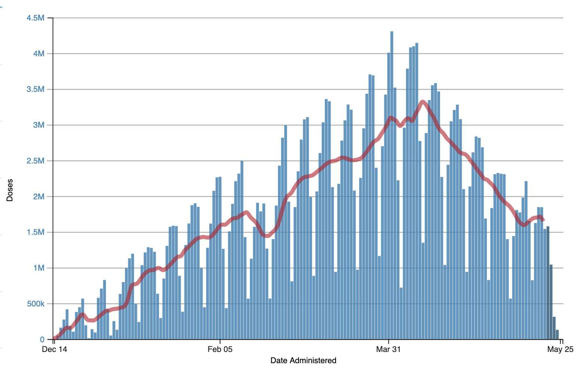
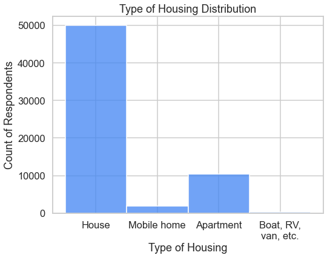

# Encouraging COVID-19 Vaccination in the US
## Understanding hesitancy

**Authors**: Jessica Miles

This repository applies machine learning models to [Household Pulse Survey results published by the Census Bureau](https://www.census.gov/programs-surveys/household-pulse-survey/datasets.html) to determine the primary predictors of vaccine hesitancy in the US. The purpose is to understand common population characteristics of those who are hesitant, so federal, state, and local governments can develop effective strategies to encourage vaccination.

## The challenge: Declining COVID-19 vaccination rate

- State and local governing bodies around the US are asking: how can we encourage more people to get vaccinated sooner?
- Percentage of vaccinated residents is a key metric used to decide when and how to lift restrictions 
- Vaccine doses administered per day initially increased as more people became eligible, but has been declining since mid-April. All adults were eligible in all states as of April 19th, 2021.
- Only 61% of adults have received at least one dose as of May 25, so there are holdouts.
- The percentage of vaccinated people to reach herd immunity varies per disease, and isn't known for COVID-19 yet. For measles it was 95%; for polio it was 80%. Our goal is herd immunity for COVID-19, and 61% is probably not enough yet.



Chart source: [CDC](https://covid.cdc.gov/covid-data-tracker/#vaccination-trends)
### Data:

## Objective of this analysis
To determine whether data-driven insights can reveal strategies to overcome hesitancy and encourage vaccination. Currently, some states are starting to offer perks such as cash or food vouchers, but it's not clear if "bribing" people in this way will be the best approach.

In this analysis, I answer the questions:
- What, if any, are common characteristics among the vaccine hesitant?
- Do hesitant people with different characteristics give different reasons for their hesitancy?

## Methods
- Trained logistic regression and random models to predict vaccine hesitancy or optimism
- Analyzed top predictors of hesitancy to understand their significance, and what insights they could provide into potential new approaches to encourage vaccination

## Sample Data Summary

- US Census Bureau's Household Pulse Survey
  - Random statistical samples from all 50 states and top 15 metro areas
  - Adults 18 years or older
  - Used data from survey conducted March 3 to March 15, 2021
  - Public microdata sample of ~78,000 responses
- Survey questions included:
  - How life had changed for the household during the pandemic
  - Vaccine doses received, intent to be vaccinated, and reasons why if did not definitely intend to be vaccinated
  - Information such as family size, housing situation, state or metro area, employment status, income, age, race and ethnicity

  See data dictionary and survey technical information in the [data](./data) folder.

### Breakdown of vaccine sentiment in survey sample


### Hesitancy reasons (multi-choice)


## Results

### Top Predictors of Hesitancy

Top predictors of hesitancy with odds over 1.5:

| Characteristic | Odds of Hesitancy |
|:-|:-|
| Household residence is a boat, RV, or van | 2.48 |
| Number of individuals under 18 in the household | 2.29 |
| Greater level of difficulty meeting household expenses in the past 7 days | 2.24 |
| Greater level of household food insufficiency in the past 7 days | 1.80 |
| Household residence is a mobile home | 1.73 |
| Respondent did not use public transportation such as bus, rail, or ride-share before the pandemic, so transportation did not change | 1.51 |
***
### Percentages per Subgroup

Percentages of hesitant respondents living in mobile homes, boats, RVs and vans are more than double the hesitant percentages of respondents in houses and apartments.


The more children residing in a household, the greater the percentage of sample respondents who reported hesitancy.


The more difficult is has been for the household to meet expenses in the prior 7 days, the greater percentage of hesitant respondents.

More than twice as many "Very difficult" households were hesitant than "Not at all difficult", although concern about vaccine cost was one of the lowest reported reasons in the overall sample.


***

### Top Hesitancy Reasons per Subgroup

Although some reasons had different percentages for different subgroups, they were mostly the same. The top 5 reasons of the most hesitant subgroups also matched the top 5 of the overall hesitant population, with the exception of food insufficiency.


Number 5 reason for people in  the "Very difficult" subgroup is Don't know if it will work, which is the number 6 reason overall. However, this is a minor difference.

***

### Distributions per Subgroup

Although these are the top predictors of hesitancy and we can see how percentage of hesitant respondents increases in these groups, the most hesitant categories represent a very small portion of the sample population.




***

### Top Predictors of Optimism

Top predictors of optimism with odds over 1.5:

| Description of Question | Odds of Optimism |
|:-|:-|
| Greater age in years | 6.06 |
| Higher level of education | 2.62 |
| Respondent identified as Asian versus other races/ethnicities| 2.22 |
| Household is in the San Francisco-Oakland-Berkeley, CA Metro Area | 2.18 |
| Members of the household had avoided eating at restaurants in the prior 7 days | 2.03 |
| Higher pre-tax income level | 1.89 |
| Members of the household had taken fewer trips to stores because of the pandemic in the prior 7 days | 1.88 |
| At least one adult in the household substituted some or all of their typical in-person work for telework | 1.51 |

There is a statistically significant difference in mean and median ages.

The hesitant group is generally younger, with a median age of 46 compared to 57 for optimistic.


***

## Summary of Results:
The top reasons for hesitancy among groups who have the highest odds of being hesitant are mostly the same as those for the whole survey sample:
- Concerns about side effects
- Preferring to wait and may get it later

Although I identified sub-groups with higher percentages of hesitant respondents, they were small in size, and represented only a small proportion of the sample. No clear leader emerged as a primary predictor of hesitancy among the many factors which contribute.

Being in political "red" or "blue" states or being in a metropolitan area (tends to be "blue"), were NOT high predictors of hesitancy or optimism.

## Recommendations:

Address the primary reasons for hesitancy across the board: concerns about side effects, and preferring to 'wait and see'.
- Collect and make public data about how likely people are to experience moderate to severe side effects

Continue efforts that are already underway to encourage people to get vaccinated sooner by offering cash or perks 
- These efforts may help convince the 'wait and see' demographic as well as those those who said they do plan to get vaccinated but haven't done it yet
- Perks that will appeal to younger demographics are advised

## Limitations & Next Steps

- Respondents were surveyed in early March. More recent surveys may reveal different trends and importance in predictors. Continuing analysis on newly available data may provide a more accurate picture, as well as help us understand how opinions about vaccines change.

- Some groups are over- or under-represented based on who actually responded to the survey

In this survey, based on comparing population percentages to 2020 census statistics:
- White respondents are over-represented
- Asian respondents are slightly under-represented
- Black and Hispanic/Latinx respondents are far under-represented

***

### For further information
Please review the narrative of my analysis in [my jupyter notebook](./index.ipynb) or review my [presentation](./presentation.pdf)

For any additional questions, please contact jess.c.miles@gmail.com.

***

## Repository Structure:

```
├── README.md               <- The top-level README for reviewers of this project.
├── index.ipynb             <- narrative documentation of analysis in jupyter notebook
├── presentation.pdf        <- pdf version of project presentation
└── images
    └── images, both sourced externally and generated from  code
└── data
    └── Public microdata file from Census bureau, data dictionary, and technical survey documentation
└── dstools
    └── Python functions used in the notebook
```
